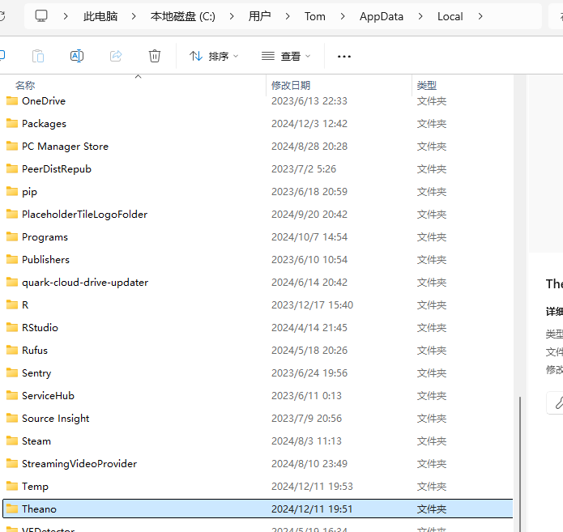

# 依赖
本代码使用VSCode测试，anaconda管理python环境

## 安装Meshlab（可选）
用于可视化.obj文件
下载地址：https://www.meshlab.net/
我这里下载的是MeshLab2023.12-windows.exe版本
下载完成后，安装到自己想要安装的目录，然后将安装的目录添加到环境变量中


## 安装python及依赖
安装python3.5版本，这个项目年份较早，且使用的是theano(已经停止维护)，所以不能用太新的python版本。
```bash
conda env create -n py35 -f .\environment.yaml  # 创建python3.5环境
conda activate py35  # 激活python3.5环境
```

拷贝.theanorc到${HOME}/.theanorc
```bash
cp .theanorc ${HOME}/.theanorc
```


# 运行demo
```bash
python demo.py prediction.obj
```
执行完成后，会自定打开Meshlab，显示重建后的3D视图
如下：


# 测试推理

创建ShapeNet文件夹，并将ShapeNetVox32和ShapeNetRendering数据解压到该文件夹内
然后命令行中执行run_test.bat
```bash
./run_test.bat
```


测试结果


结果存储在 精度.txt和output/default/test路径下

# 常见错误

执行demo.py时，报错：
```bash
NameError: ('The following error happened while compiling the node', forall_inplace,cpu,scan_fn}(Shape_i{0}.0, Subtensor{int64:int64:int8}.0, IncSubtensor{InplaceSet;:int64:}.0, IncSubtensor{InplaceSet;:int64:}.0, <TensorType(float32, 4D)>, <TensorType(float32, 4D)>, <TensorType(float32, 4D)>, <TensorType(float32, 4D)>, <TensorType(float32, 4D)>, <TensorType(float32, 4D)>, <TensorType(float32, 4D)>, <TensorType(float32, 4D)>, <TensorType(float32, 4D)>, <TensorType(float32, 4D)>, <TensorType(float32, 4D)>, <TensorType(float32, 4D)>, <TensorType(float32, 4D)>, <TensorType(float32, 4D)>, <TensorType(float32, 4D)>, <TensorType(float32, matrix)>, <TensorType(float32, matrix)>, <TensorType(float32, matrix)>, <TensorType(float32, matrix)>, InplaceDimShuffle{x,x,0,x,x}.0, InplaceDimShuffle{x,0}.0, InplaceDimShuffle{x,0,x,x}.0, InplaceDimShuffle{x,0,x,x}.0, InplaceDimShuffle{x,0,x,x}.0, InplaceDimShuffle{x,0,x,x}.0, InplaceDimShuffle{x,0,x,x}.0, InplaceDimShuffle{x,0,x,x}.0, InplaceDimShuffle{x,0,x,x}.0, InplaceDimShuffle{x,0,x,x}.0, InplaceDimShuffle{x,0,x,x}.0, InplaceDimShuffle{x,0,x,x}.0, InplaceDimShuffle{x,0,x,x}.0, InplaceDimShuffle{x,0,x,x}.0, InplaceDimShuffle{x,0,x,x}.0, InplaceDimShuffle{x,0,x,x}.0, InplaceDimShuffle{x,0,x,x}.0, InplaceDimShuffle{x,x,0,x,x}.0, InplaceDimShuffle{x,x,0,x,x}.0, Shape_i{4}.0, Shape_i{3}.0, Shape_i{1}.0, Shape_i{0}.0, Shape_i{4}.0, Shape_i{3}.0, Shape_i{1}.0, Shape_i{0}.0, Shape_i{4}.0, Shape_i{3}.0, Shape_i{1}.0, Shape_i{0}.0, Reshape{4}.0, Reshape{4}.0, Reshape{4}.0), '\n', "name 'CVM' is not defined")
```
尝试下面语句清除theano缓存
```bash
theano-cache purge
```

如果还出现theano问题，删除这个路径下的Theano文件夹再试
