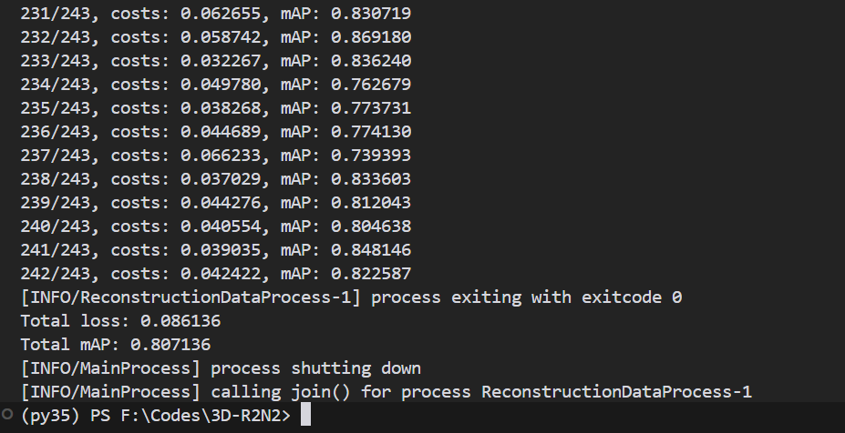

# 依赖
本代码使用VSCode测试

## 安装Meshlab（可选）
用于可视化.obj文件
下载地址：https://www.meshlab.net/
我这里下载的是MeshLab2023.12-windows.exe版本
下载完成后，安装到自己想要安装的目录，然后将安装的目录添加到环境变量中


## 安装python及依赖
安装python3.5版本，这个项目年份较早，且使用的是theano(已经停止维护)，所以不能用太新的python版本。
```bash
conda create -n py35 python=3.5
conda activate py35
```
pip安装依赖库
```bash
pip install -r requiremenets.txt
```
用conda安装这几个额外的依赖
```bash
conda install m2w64-toolchain # 用于编译theano

conda install pygpu # GPU
```

拷贝.theanorc到${HOME}/.theanorc
```bash
cp .theanorc ${HOME}/.theanorc
```


# 运行demo
```bash
python demo.py prediction.obj
```
执行完成后，会自定打开Meshlab，显示重建后的3D视图
如下：


# 测试推理

创建ShapeNet文件夹，并将ShapeNetVox32和ShapeNetRendering数据解压到该文件夹内
然后命令行中执行run_test.bat
```bash
./run_test.bat
```


测试结果


